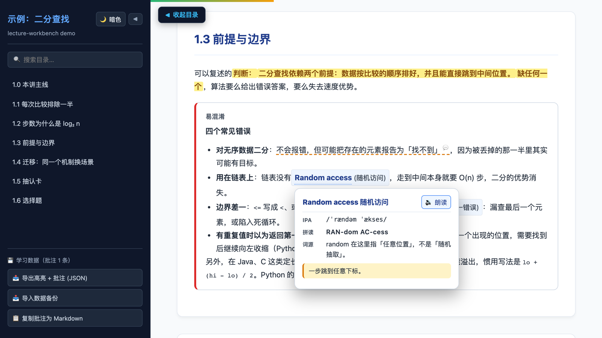

# lecture-workbench

[](https://github.com/JoshuaViolet/lecture-workbench/actions/workflows/ci.yml)
[](LICENSE)

Turn lecture notes into a **single, self-contained HTML study guide** that works offline. Double-click the file and you get highlights, margin notes, term cards, flashcards and practice questions: no server, no CDN, no install.

**[Live demo](https://joshuaviolet.github.io/lecture-workbench/)** · [架构说明 / Architecture](docs/architecture.md) · [中文说明](README.zh-CN.md)



> Status: **v0.1, early**. I built this for my own university courses and extracted it into a reusable tool. The page UI is in Simplified Chinese for now. Open problems are listed in [KNOWN_ISSUES.md](KNOWN_ISSUES.md).

## Features

- **Highlights and margin notes** that survive reloads, even when the selection crosses bold text or other inline markup. Stored per guide in `localStorage`; export/import as JSON, or copy as Markdown.
- **Term cards** on hover: IPA, stressed syllables, etymology, a memory hook, and pronunciation through the Web Speech API.
- **Flashcards** and **multiple-choice questions** with explanations. Options are shuffled on every render so the position of the answer can't be learned instead of the content.
- **Teaching components** for structuring a lesson: chapter spine, evidence / limitation / misconception / transfer blocks, study cards.
- **Print mode** that forces a light theme and appends a self-test sheet with the answer key.
- Dark mode, collapsible sidebar, reading progress, keyboard support, `prefers-reduced-motion`.

## Quick start

Requires Python 3.9+ and Node.js (the validator uses Node to syntax-check the page and audit term cards).

```bash
git clone https://github.com/JoshuaViolet/lecture-workbench.git
cd lecture-workbench
python3 framework/build_guide.py --all --validate
open subjects/demo-binary-search/Binary_Search_Demo.html
```

## Writing a subject

A subject is a folder under `subjects/`:

```
subjects/my-lecture/
  config.json      identity, titles, header and table-of-contents HTML, output file name
  content.html     the lesson body: <section>s with your text, figures and components
  data.json        flashcards, mcqData, termLexicon
  assets/          images referenced from content.html (optional)
```

`config.json`:

```json
{
  "doc_id": "my_lecture",
  "app_id": "my-lecture-guide",
  "title": "My Lecture",
  "output": "My_Lecture.html",
  "header_html": "<header class=\"doc-header\"><h1>My Lecture</h1></header>",
  "nav_html": "<li><a href=\"#intro\">Introduction</a></li>"
}
```

`doc_id` namespaces everything the guide stores, so it must be unique across your guides and must not change after you start using a guide.

`data.json` (checked at build time; errors point at the exact item and field):

```json
{
  "flashcards":  [{ "front": "…", "back": "…" }],
  "mcqData":     [{ "q": "…", "opts": ["…", "…", "…", "…"], "ans": 2, "exp": "…" }],
  "termLexicon": [{ "keys": ["binary search"], "term": "Binary search 二分查找",
                    "ipa": "/ˈbaɪnəri sɜːtʃ/", "chunks": "BI-na-ry SEARCH",
                    "parts": "…", "hook": "…" }]
}
```

`ans` is the 0-based index of the correct option in `opts`. Add `"shuffle": false` to a question whose options must stay in order. A term in `content.html` gets a hover card when it is written as

```html
<span class="term"><span class="en">Binary search</span> <span class="zh">(二分查找)</span></span>
```

or as `<strong>…</strong>` text that matches one of the `keys`. Copy-paste snippets for the teaching components are in [examples/](examples/).

Coming from the older `data.js` format: `python3 framework/migrate_datajs.py subjects/<name>`.

## Validation

`build_guide.py --validate` (or `validate_guide.py <guide.html>`) checks the generated page:

| Check | Catches |
|---|---|
| structure | broken `#anchors`, `getElementById` targets that don't exist, undefined inline handlers, unbalanced tags, unfilled placeholders, script syntax errors |
| content | raw LaTeX (there is no math renderer), missing images, English terms with no term card |
| teaching-quality lint | the correct option being the longest one in most questions, answers clustered on one letter, duplicate questions |

Lint findings are warnings; `--strict` turns them into failures.

## Development

```bash
python3 -m venv .venv && .venv/bin/pip install -r requirements-dev.txt
.venv/bin/python -m playwright install chromium   # or set PW_CHANNEL=chrome to use an installed Chrome
.venv/bin/pytest
```

The suite has unit tests for the builder and validator, and Playwright tests that open the built demo from `file://` and drive it like a student: select text, click the toolbar, reload, export and import a backup.

## License

[MIT](LICENSE)

## Acknowledgments

Developed with AI assistance (Claude).
